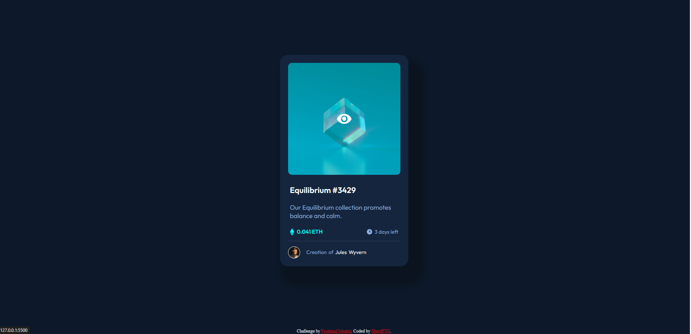
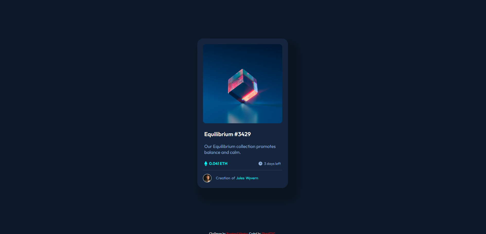

# Frontend Mentor - NFT preview card component solution

This is a solution to the [NFT preview card component challenge on Frontend Mentor](https://www.frontendmentor.io/challenges/nft-preview-card-component-SbdUL_w0U). Frontend Mentor challenges help you improve your coding skills by building realistic projects.

## Table of contents

- [Overview](#overview)
  - [The challenge](#the-challenge)
  - [Screenshot](#screenshot)
  - [Links](#links)
- [My process](#my-process)
  - [Built with](#built-with)
  - [What I learned](#what-i-learned)
  - [Continued development](#continued-development)
  - [Useful resources](#useful-resources)
- [Author](#author)
- [Acknowledgments](#acknowledgments)

**Note: Delete this note and update the table of contents based on what sections you keep.**

## Overview

### The challenge

Users should be able to:

- View the optimal layout depending on their device's screen size
- See hover states for interactive elements

### Screenshot

### Links

- Solution URL: [https://github.com/Sheriff702/NFT-preview-card-component.git]
- Live Site URL: [https://sheriff702.github.io/NFT-preview-card-component/]

## My process

### Built with

### What I learned

What i've learnt here is how to put one picture over another.
it was hard in the beginning but then i got an grasp over it after watching some videos

### Continued development

putting a picture over one and then putting a hover over it.

### Useful resources

## Author

- Frontend Mentor - [@sheriff702](https://www.frontendmentor.io/profile/Sheriff702)
- Twitter - [@svarta_shunon](https://twitter.com/svarta_shunon)
